# Zuri — Relatório Técnico
### Leitura digital por subscrição (PWA) para o mercado moçambicano

> **Grupo:** _[nomes dos 6 membros]_ · **Cadeira:** _[disciplina]_ · **Data:** Julho 2026
> **App em produção:** https://zuribook.page · **Repositório:** _[link]_

**Legenda de estado** (usar na apresentação para ser honesto sobre o âmbito):
`✅ Implementado e em produção` · `⚠️ MVP / simplificado` · `🔷 Desenhado, por implementar`

---

## Divisão da apresentação (6 pessoas)

| # | Apresentador | Secções | Tempo sugerido |
|---|---|---|---|
| 1 | _[Pessoa 1]_ | 0. Design (Figma) · 1. Visão geral | ~5 min |
| 2 | _[Pessoa 2]_ | 2. Arquitectura · Zero-Trust | ~5 min |
| 3 | _[Pessoa 3]_ | 3. Modelo de dados · RLS | ~5 min |
| 4 | _[Pessoa 4]_ | 4. Pagamentos M-Pesa · Subscrição | ~5 min |
| 5 | _[Pessoa 5]_ | 5. Conteúdo/DRM · 6. Offline & Sync | ~5 min |
| 6 | _[Pessoa 6]_ | 7. Gamificação · 8. Partilha · 9. Infra · 10. Roadmap | ~6 min |

---

## Índice
0. [Design (Figma)](#0-design-figma)
1. [Visão geral — princípios & NFRs](#1-visão-geral)
2. [Arquitectura — 4 camadas & Zero-Trust](#2-arquitectura)
3. [Modelo de dados — ER, SQL & RLS](#3-modelo-de-dados)
4. [Pagamentos M-Pesa](#4-pagamentos-m-pesa)
5. [Conteúdo & Acesso (DRM leve)](#5-conteúdo--acesso)
6. [Offline & Sincronização](#6-offline--sincronização)
7. [Gamificação](#7-gamificação)
8. [Partilha viral](#8-partilha-viral)
9. [Infraestrutura](#9-infraestrutura)
10. [Roadmap técnico & ADRs](#10-roadmap-técnico--adrs)
- [Apêndice — lista de diagramas & screenshots](#apêndice)

---

## 0. Design (Figma)

**Processo de design** (mostrar a evolução):
1. **Pesquisa** — leitores moçambicanos, restrições (dados caros, telemóveis modestos, pagamento por M-Pesa).
2. **Wireframes** de baixa fidelidade — fluxos principais (onboarding, catálogo, leitor, paywall).
3. **Design system** — tokens de cor, tipografia, componentes.
4. **Alta fidelidade** — ecrãs finais no Figma.
5. **Protótipo interativo** — navegação clicável para testes.
6. **Handoff** — do Figma para código (tokens → CSS variables).

**Design system implementado** (`src/styles/tokens.css`):
- **Cor de marca:** `#C96A58` (terracota) · fundos, texto e bordas via *CSS variables* (tema claro/escuro).
- **Tipografia:** Playfair Display (títulos, serifa itálica), Nunito (interface), Lora (leitor).
- **Componentes reutilizáveis:** `BookCover`, `BookCard`, `Button`, `Chip`, `BottomSheet`, `TabBar`/`Sidebar`, `Icon`.

> 📊 **Diagrama:** *User-flow* (fluxograma dos ecrãs) — ver Mermaid abaixo.

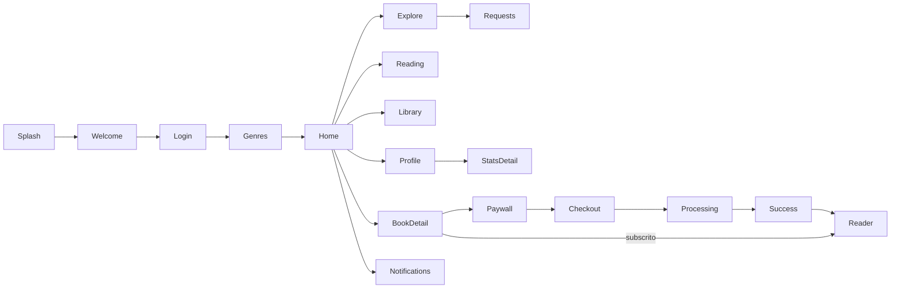

> 📸 **Screenshots a incluir:**
> - Board de *wireframes* (Figma)
> - Board do *design system* (paleta + tipografia + componentes)
> - 3–4 ecrãs de **alta fidelidade** (Figma)
> - **Lado a lado**: mockup Figma **vs** app real (prova de fidelidade do handoff)

---

## 1. Visão geral

**Princípios de engenharia**

| Princípio | O que significa no Zuri |
|---|---|
| **Zero-Trust** | O cliente nunca é confiável. A autorização é por linha na base de dados (RLS); a activação de subscrição só acontece no servidor. |
| **Offline-first** | Ler sem rede. O estado local (IndexedDB) é a primeira fonte; o servidor sincroniza. |
| **Custo baixo** | *Free-tiers permanentes* (não créditos que expiram). Grátis até ~10k utilizadores. |
| **DRM leve** 🔷 | Proteger o conteúdo sem fricção: acesso ao EPUB só após verificação de subscrição (URL assinado de curta duração). |
| **PWA-first** | Um só código, instalável em telemóvel/tablet/laptop, sem app store, actualização instantânea. |

**Requisitos não-funcionais (NFRs)**

| NFR | Alvo | Estado |
|---|---|---|
| Performance | *bundle* inicial < 100 KB gzip; leitura fluida | ✅ ~94 KB |
| Custo | 0 MT até ~10k users | ✅ free-tiers |
| Offline | ler livros descarregados sem rede | ✅ |
| Segurança de dados | isolamento por utilizador (RLS) | ✅ |
| Segurança de conteúdo | EPUB inacessível a não-subscritores | ⚠️ público no MVP → 🔷 URL assinado |
| Responsividade | telemóvel, tablet, laptop | ✅ |
| Idioma / A11y | 100% português; contraste, alvos de toque | ✅ pt / ⚠️ a11y parcial |

> 📸 **Screenshots:** Home no **telemóvel** e no **desktop** (lado a lado, para mostrar a responsividade).

---

## 2. Arquitectura

**4 camadas** — Cliente → *Gatekeeper* → Dados/Vault → M-Pesa.

> 📊 **Diagrama:** Arquitectura em camadas (C4 nível 2 / componentes).

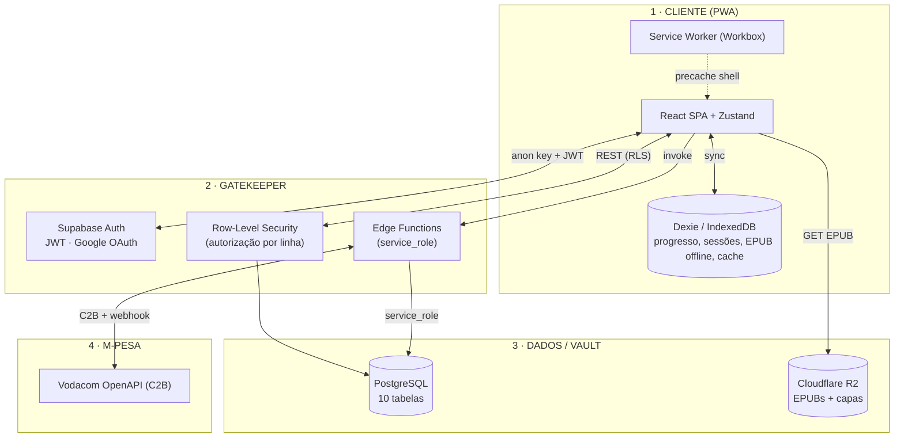

**Fronteira Zero-Trust (o ponto-chave da apresentação):**
- A `anon key` é **pública por desenho** — não dá acesso a nada sem passar pela **RLS**.
- O cliente **nunca** consegue tornar uma subscrição `active`: só a Edge Function (com `service_role`) chama `activate_subscription`, e só a partir do *webhook* do M-Pesa.
- O progresso de leitura é **monotónico no servidor** (um *trigger* impede regressões).

> 📸 **Screenshots:** dashboard Supabase (Auth + Database), painel R2 no Cloudflare.

---

## 3. Modelo de dados

**10 tabelas** (8 do núcleo + `favorites` e `notifications` acrescentadas com as funcionalidades).

> 📊 **Diagrama:** ER (entidade-relação).

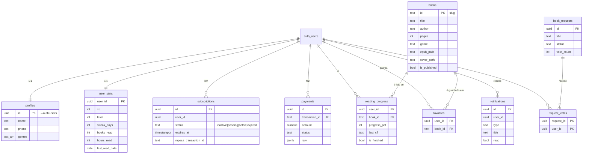

**Excerto do schema SQL** (mostrar 1–2 tabelas + os *checks*):

```sql
create table public.subscriptions (
  id                   uuid primary key default gen_random_uuid(),
  user_id              uuid not null references auth.users(id) on delete cascade,
  status               text not null default 'inactive'
                         check (status in ('inactive','pending','active','expired')),
  expires_at           timestamptz,
  mpesa_transaction_id text
);
create table public.reading_progress (
  user_id      uuid references auth.users(id) on delete cascade,
  book_id      text references public.books(id) on delete cascade,
  progress_pct int  not null default 0 check (progress_pct between 0 and 100),
  is_finished  boolean not null default false,
  primary key (user_id, book_id)
);
```

**Políticas RLS** (a tabela mais importante da secção):

| Tabela | SELECT | INSERT / UPDATE | Racional |
|---|---|---|---|
| `books` | público se `is_published` | — (só `service_role`) | catálogo é leitura pública |
| `profiles`, `user_stats`, `reading_progress`, `favorites`, `notifications` | `user_id = auth.uid()` | próprio | isolamento por utilizador |
| `subscriptions`, `payments` | próprio (SELECT) | **sem** política de escrita → cliente **não escreve** | activação só via `service_role` |
| `request_votes` | próprio (privacidade) | próprio | voto secreto; contagem denormalizada por *trigger* |
| `book_requests` | todos os autenticados | criar como autor | quadro público de pedidos |

**Funções & triggers**
- `handle_new_user()` — no *signup* cria `profile` + `user_stats` + `subscription` inactiva.
- `enforce_progress_monotonic()` — `BEFORE UPDATE` em `reading_progress`: `progress_pct := greatest(new, old)`.
- `sync_vote_count()` — `SECURITY DEFINER`, mantém `book_requests.vote_count`.
- `activate_subscription()` — `SECURITY DEFINER`, **revogada** de anon/authenticated (só `service_role`).

> 📸 **Screenshots:** Supabase → Table Editor (lista das tabelas), Policies de uma tabela, SQL Editor com uma migração.

---

## 4. Pagamentos M-Pesa

> **Estado:** 🔷 Edge Functions **escritas** (`supabase/functions/mpesa-*`), com ponte de pagamento **simulada** em produção até haver credenciais de *merchant* Vodacom.

> 📊 **Diagrama:** Sequência do pagamento (C2B single-stage).

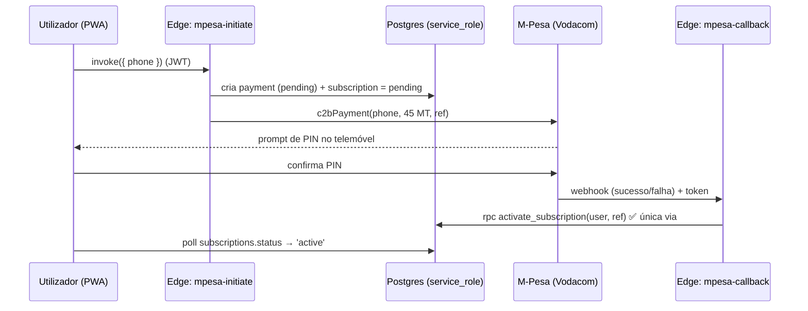

> 📊 **Diagrama:** Máquina de estados da subscrição.

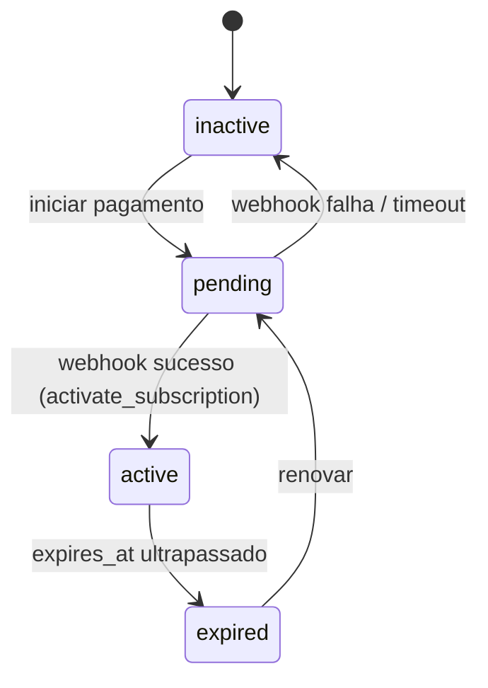

**Tratamento de falhas**
- **PIN não confirmado / timeout** → `payment.failed`, subscrição volta a `inactive`.
- **Webhook forjado** → barreira por *token* na URL (`?token=…`) + (🔷) verificação de assinatura.
- **Idempotência** → `transaction_id` único; `activate_subscription` é seguro re-executar.

> 📸 **Screenshots:** ecrãs Checkout → Processing → Success; tabela `payments`; (código) `activate_subscription`.

---

## 5. Conteúdo & Acesso

**Ciclo de vida do EPUB — 3 estados.**

> 📊 **Diagrama:** Estados do conteúdo.

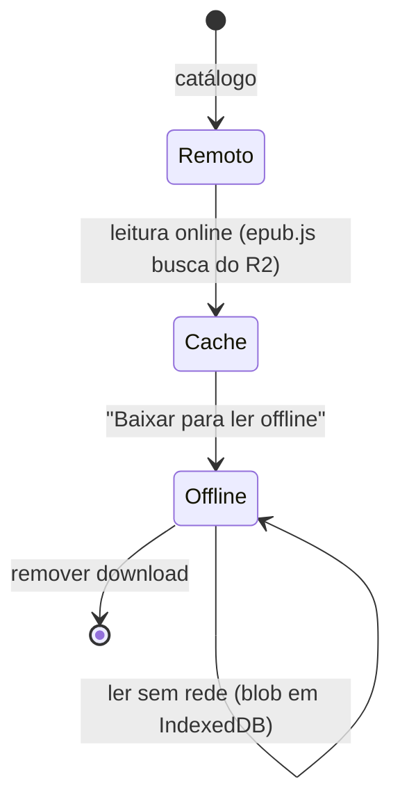

**Modelo de acesso (segurança de conteúdo)**
- ⚠️ **MVP actual:** EPUBs servidos por **URL público** do R2 (`pub-….r2.dev/…epub`). Simples, mas o *paywall* é só UI — qualquer pessoa com o URL descarrega.
- 🔷 **Endurecimento planeado (DRM leve):** uma Edge Function/Worker **verifica a subscrição activa** e devolve um **URL assinado de curta duração** (ou faz *stream*). Opcional: **download encriptado AES-256** (Web Crypto), decifrado só no cliente subscrito.

**Capas reais** ✅ — extraídas do próprio EPUB (`scripts/extract-covers.cjs`): lê o OPF (`meta name=cover` → *manifest*) com *fallback* para a maior imagem, redimensiona (~600px) e sobe para R2; `books.cover_path` aponta lá.

> 📸 **Screenshots:** leitor aberto (mobile + desktop), botão "Baixar" com barra de progresso, tab "Baixados", painel R2 com `epubs/` e `covers/`.

---

## 6. Offline & Sincronização

**Camadas de persistência local** (Dexie / IndexedDB, `src/data/db.ts`):

| Store | Guarda |
|---|---|
| `readingProgress` | progresso + `lastCfi` por livro (monotónico) |
| `readingSessions` | sessões de leitura (minutos por dia) → atividade/stats |
| `offlineBooks` | o **EPUB inteiro** (ArrayBuffer) para ler offline |
| `booksCache` | catálogo em cache → livros visíveis sem rede |

> 📊 **Diagrama:** Fila de sync & resolução de conflitos.

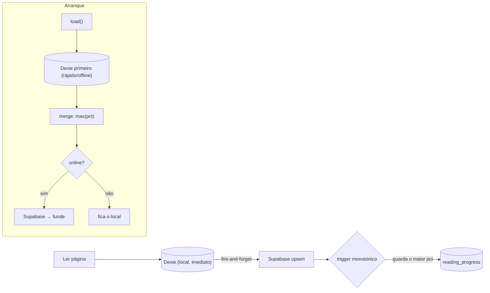

**Resolução de conflitos:** *last-write* não serve para progresso (pode regredir). Usa-se **monotonia** — fica sempre o **maior** `progress_pct` (cliente e *trigger* no servidor). Sessão persistente offline: em erro de rede (`navigator.onLine === false`) **não** se limpa a sessão.

> 📸 **Screenshots:** DevTools → Application → IndexedDB (stores com dados); ler com o modo avião ligado.

---

## 7. Gamificação

**XP & níveis** (`src/data/catalog.ts`, `user_stats`):

| Nível | Nome | XP |
|---|---|---|
| I | Leitor Iniciante | 0 |
| II | Explorador | 2 500 |
| III | Contador de Histórias | 8 000 |
| IV | Guardião das Palavras | 20 000 |

- **Fontes de XP:** ✅ +50 por pedido de livro · 🔷 XP por páginas/livros lidos.
- **Streak** ✅ — dias consecutivos via `last_read_date` (hoje→nada, ontem→+1, senão→1).
- **Livros lidos** ✅ — incrementa ao cruzar **95%** pela 1ª vez.
- **Horas** ✅ — somadas das sessões de leitura (Dexie).
- **Subida de nível** → cria **notificação** e emite o modal de celebração.

> 📊 **Diagrama:** Arquitectura do *trigger*/store de gamificação.

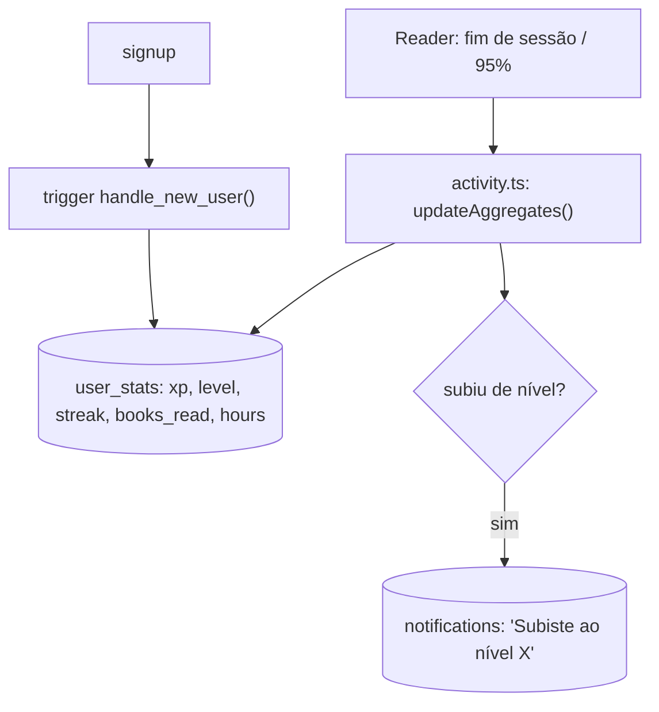

> 📸 **Screenshots:** ecrã Perfil (XP + níveis + streak), ecrã "Stats detalhados" (gráfico de 30 dias, por género), modal/notificação de subida de nível.

---

## 8. Partilha viral

**5 cartões** (1080×1920, `src/screens/social/share-cards/`): Livro lido · Streak · Nível · Wrapped · Citação — todos com **dados reais** do utilizador.

**Mecanismo:** `html2canvas` captura um nó *offscreen* em tamanho real → `navigator.share({ files })` (menu nativo com WhatsApp/Instagram/…) com *fallback* de *download*.

> 📊 **Diagrama:** *Loop* viral.

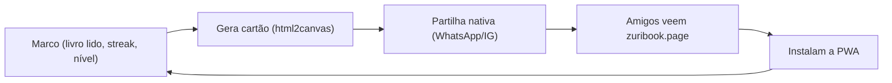

- 🔷 **Referral tracking** (atribuir instalações a quem partilhou) — por implementar.

> 📸 **Screenshots:** modal de partilha (preview + botões), os **5 cartões**, o menu de partilha nativo do telemóvel.

---

## 9. Infraestrutura

**Stack *free-tier*** ✅

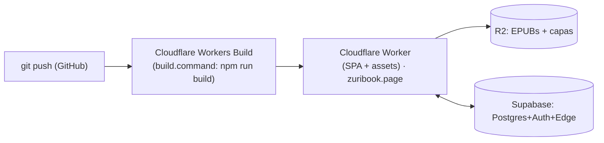

- **Cloudflare** (Worker/Pages + R2, *egress* grátis) · **Supabase** (Postgres+Auth+RLS+Edge, região EU) · **GitHub** (CI/CD) · domínio `.page` (GitHub Student Pack).

**Capacity planning por fase**

| Fase | Users | O que aguenta o free-tier | Ação |
|---|---|---|---|
| 0–1k | arranque | Supabase free (500 MB) + R2 (10 GB) | nada |
| 1k–10k | crescimento | ainda dentro do free-tier; vigiar egress/DB | observabilidade (Sentry) |
| 10k+ | escala | Supabase Pro, R2 pago, CDN | 🔷 upgrade + cache agressivo |

- 🔷 **Observabilidade:** Sentry/Datadog (Student Pack) por ligar.

> 📸 **Screenshots:** Cloudflare (Worker + R2 + domínio), logs de *build*/deploy, Supabase (uso do free-tier).

---

## 10. Roadmap técnico & ADRs

**Fases**
- **Fase 1 (feito ✅):** PWA responsiva, catálogo real, auth Google, leitor epub.js, offline, gamificação, partilha, notificações, deploy CI/CD.
- **Fase 2 (a seguir 🔷):** M-Pesa real + gate de subscrição ligado ao Postgres; **acesso ao conteúdo seguro** (URL assinado); mais catálogo.
- **Fase 3 (escala 🔷):** referral, push (VAPID), observabilidade, i18n adicional, upgrade de tier.

> 📊 **Diagrama:** *Roadmap* (linha temporal).

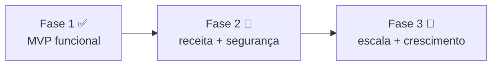

**Registos de decisão de arquitectura (ADRs)**

| # | Decisão | Escolha | Porquê |
|---|---|---|---|
| 1 | Nativo/Expo **vs** PWA | **PWA** | um código, sem app store, actualização instantânea, instalável em telemóvel/tablet/laptop |
| 2 | *Vault* de EPUBs | **R2** (rejeitado **Telegram**) | Telegram viola ToS (ban=perde catálogo) e exige *proxy*; R2 tem *egress* grátis |
| 3 | *Backend* | **Supabase** | Postgres + Auth + RLS + Edge num free-tier durável |
| 4 | Custos | **Free-tiers permanentes** (não créditos) | créditos criam um precipício quando acabam |
| 5 | Segurança de conteúdo | **DRM leve** (URL assinado) 🔷 | proteger sem fricção; DRM pesado afasta e complica o offline |
| 6 | Cartões de partilha | **html2canvas** (web) | render fiel no browser sem dependências nativas |

---

## Apêndice

### Lista de diagramas (todos em Mermaid, prontos a exportar como imagem)
1. **User-flow** dos ecrãs — §0 Design
2. **Arquitectura em camadas** (C4/componentes) — §2
3. **ER** das 10 tabelas — §3
4. **Sequência** do pagamento M-Pesa — §4
5. **Máquina de estados** da subscrição — §4
6. **Estados do EPUB** (remoto/cache/offline) — §5
7. **Fila de sync & conflitos** — §6
8. **Trigger/store de gamificação** — §7
9. **Loop viral** de partilha — §8
10. **Deployment/CI-CD** — §9
11. **Roadmap** (linha temporal) — §10

> Como exportar: abrir este `.md` no VS Code (extensão *Markdown Preview Mermaid*) ou no GitHub, ou colar cada bloco em https://mermaid.live e exportar PNG/SVG para os *slides*.

### Lista de screenshots a tirar
- **Design:** wireframes, design system, alta fidelidade, Figma vs app real
- **App (mobile + desktop):** Home, Explorar, Biblioteca, Perfil
- **Leitor:** página aberta, preferências, "Baixar"/progresso, tab "Baixados"
- **Paywall:** Checkout, Processing, Success
- **Social:** modal de partilha + 5 cartões, menu de partilha nativo, Notificações, Mais pedidos
- **Stats:** Perfil (XP/streak), Stats detalhados (gráfico)
- **Backend:** Supabase (tabelas, policies, SQL), Cloudflare (Worker, R2, domínio), logs de deploy
- **Offline:** DevTools → IndexedDB; ler em modo avião

---

_Relatório gerado a partir do código real do projecto. Manter os marcadores ✅/⚠️/🔷 na apresentação — demonstra rigor e evita afirmar o que ainda não está feito._
