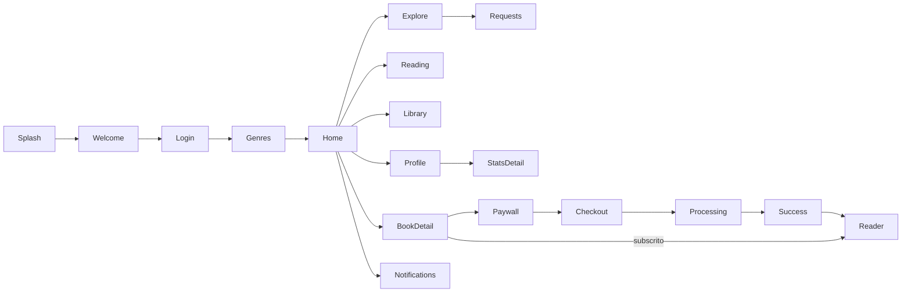
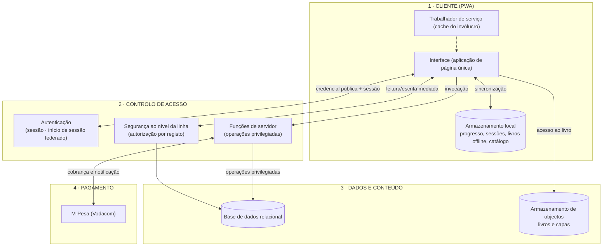
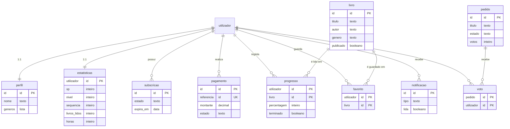
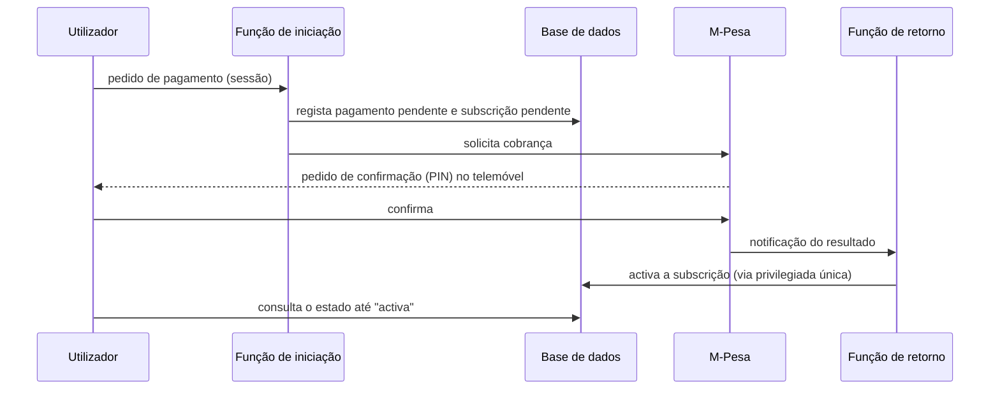
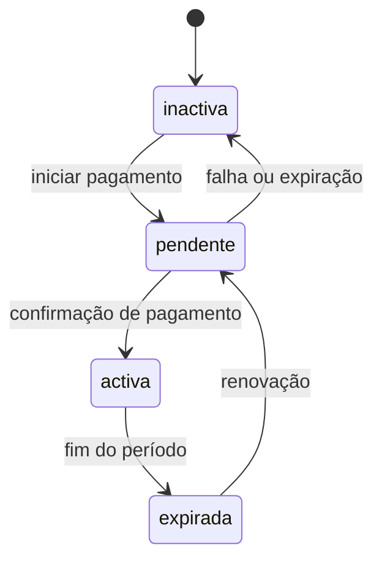
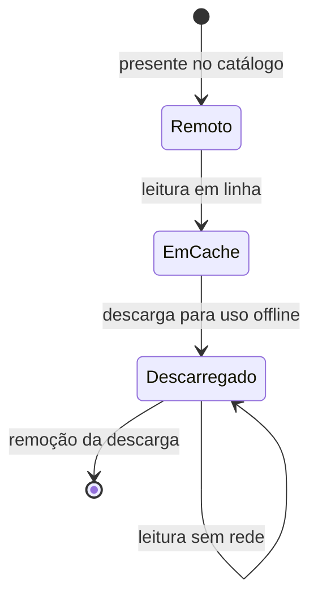
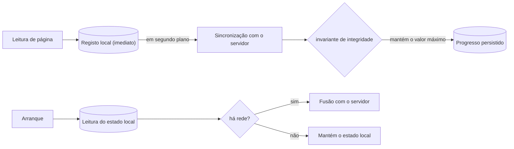
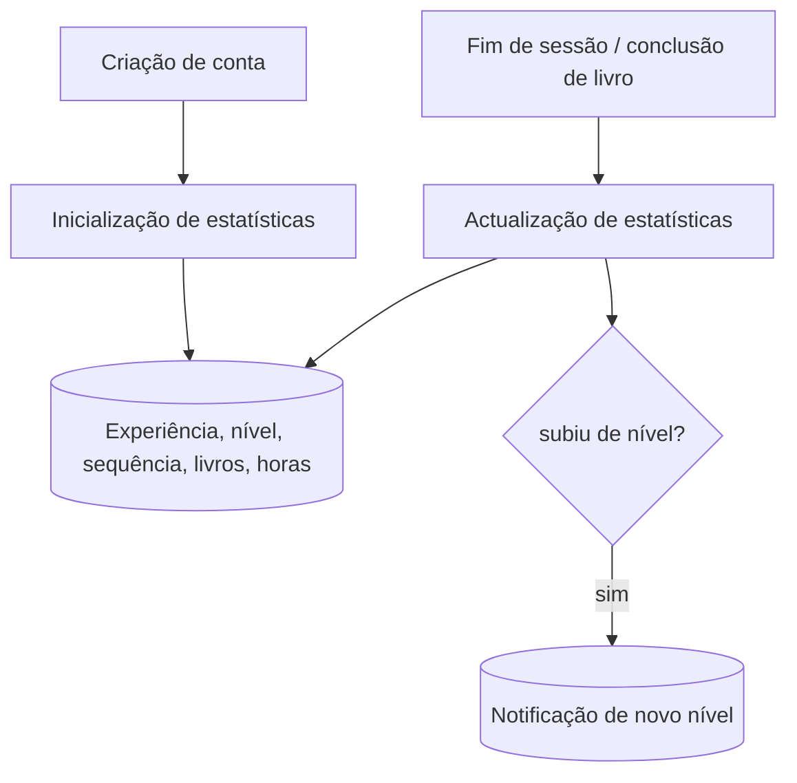
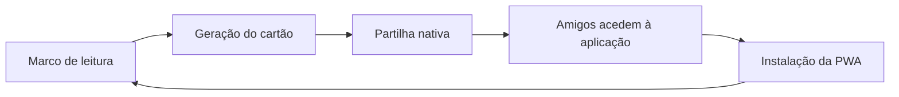
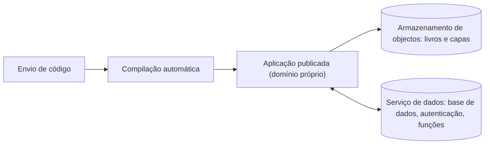

# Zuri — Relatório Técnico
### Leitura digital por subscrição (*Progressive Web App*) para o mercado moçambicano

> **Grupo:** _[nomes dos 6 membros]_ · **Cadeira:** _[disciplina]_ · **Data:** Julho 2026
> **Aplicação:** https://zuribook.page · **Repositório:** _[link]_

---

## Resumo

O Zuri é uma aplicação de leitura digital por subscrição, concebida para o contexto
moçambicano — redes móveis dispendiosas, dispositivos modestos e pagamento por M-Pesa.
Foi desenvolvida como *Progressive Web App* (PWA): um único código, instalável em
telemóvel, *tablet* e computador portátil, sem recurso a lojas de aplicações. Este
relatório descreve o processo de *design*, a arquitectura do sistema, o modelo de dados,
os subsistemas de pagamento, protecção de conteúdo, funcionamento *offline*, gamificação
e partilha, bem como a infraestrutura de suporte.

---

## Distribuição da apresentação (6 elementos)

| # | Apresentador | Secções | Tempo |
|---|---|---|---|
| 1 | _[Elemento 1]_ | 0. *Design* (Figma) · 1. Visão geral | ~5 min |
| 2 | _[Elemento 2]_ | 2. Arquitectura e *Zero-Trust* | ~5 min |
| 3 | _[Elemento 3]_ | 3. Modelo de dados e segurança de acesso | ~5 min |
| 4 | _[Elemento 4]_ | 4. Pagamentos M-Pesa e subscrição | ~5 min |
| 5 | _[Elemento 5]_ | 5. Conteúdo e protecção · 6. *Offline* e sincronização | ~6 min |
| 6 | _[Elemento 6]_ | 7. Gamificação · 8. Partilha · 9. Infraestrutura | ~6 min |

---

## Índice
0. [Processo de *design* (Figma)](#0-processo-de-design-figma)
1. [Visão geral — princípios e requisitos](#1-visão-geral)
2. [Arquitectura do sistema](#2-arquitectura-do-sistema)
3. [Modelo de dados e segurança de acesso](#3-modelo-de-dados-e-segurança-de-acesso)
4. [Pagamentos M-Pesa e subscrição](#4-pagamentos-m-pesa-e-subscrição)
5. [Conteúdo e protecção](#5-conteúdo-e-protecção)
6. [Funcionamento *offline* e sincronização](#6-funcionamento-offline-e-sincronização)
7. [Gamificação](#7-gamificação)
8. [Partilha](#8-partilha)
9. [Infraestrutura](#9-infraestrutura)
- [Apêndice — figuras e capturas de ecrã](#apêndice)

---

## 0. Processo de *design* (Figma)

O desenvolvimento foi precedido de uma fase de concepção visual e de interacção,
conduzida no Figma, com as seguintes etapas:

1. **Investigação** — caracterização do público-alvo (leitores moçambicanos) e das
   restrições do contexto (custo dos dados móveis, capacidade dos dispositivos, meio de
   pagamento predominante).
2. **Esquiços de baixa fidelidade** (*wireframes*) — definição dos fluxos principais:
   integração inicial (*onboarding*), catálogo, leitor e subscrição.
3. **Sistema de *design*** — definição de fichas de estilo (*design tokens*): paleta
   cromática, tipografia e biblioteca de componentes reutilizáveis.
4. **Protótipos de alta fidelidade** — desenho final dos ecrãs.
5. **Protótipo interativo** — ligação navegável entre ecrãs para validação com utilizadores.
6. **Transferência para desenvolvimento** (*handoff*) — as fichas de estilo do Figma foram
   traduzidas directamente em variáveis de estilo da aplicação, garantindo fidelidade
   entre o desenho e a implementação.

O sistema de *design* assenta numa cor de marca terracota, num tema duplo (claro e escuro)
gerido por variáveis de estilo, e numa tipografia que combina uma serifa expressiva para
títulos, uma sem-serifa legível para a interface e uma serifa de leitura para o corpo do livro.

**Figura 1 — Fluxo de navegação entre ecrãs** (*user-flow*):

*Capturas sugeridas:* painel de *wireframes*; painel do sistema de *design* (paleta,
tipografia, componentes); ecrãs de alta fidelidade; comparação lado a lado entre o
protótipo Figma e a aplicação final.

---

## 1. Visão geral

**Princípios orientadores**

| Princípio | Aplicação no Zuri |
|---|---|
| **Zero-Trust** | O cliente nunca é considerado de confiança. A autorização é aplicada ao nível de cada registo na base de dados, e as operações sensíveis são exclusivas do servidor. |
| **Offline-first** | A leitura não depende de ligação permanente. O estado local é a primeira fonte de verdade; o servidor sincroniza quando há rede. |
| **Custo sustentável** | A fundação assenta em escalões gratuitos permanentes, evitando dependências de créditos temporários. |
| **Protecção do conteúdo** | O acesso ao ficheiro do livro é mediado por verificação de subscrição, sem introduzir fricção para o leitor legítimo. |
| **PWA-first** | Um só código, instalável e actualizável instantaneamente, sem intermediação de lojas de aplicações. |

**Requisitos não-funcionais**

| Requisito | Alvo |
|---|---|
| Desempenho | pacote inicial reduzido (< 100 KB comprimido); leitura fluida |
| Custo operacional | nulo até à ordem dos 10 000 utilizadores |
| Disponibilidade *offline* | leitura de livros descarregados sem rede |
| Isolamento de dados | separação estrita entre utilizadores |
| Protecção de conteúdo | ficheiro do livro inacessível a não-subscritores |
| Responsividade | telemóvel, *tablet* e computador |
| Idioma e acessibilidade | interface integralmente em português; contraste e alvos de toque adequados |

*Capturas sugeridas:* ecrã principal em telemóvel e em computador (lado a lado), para
evidenciar a responsividade e o tema claro/escuro.

---

## 2. Arquitectura do sistema

O sistema organiza-se em quatro camadas, do cliente ao serviço de pagamento.

**Figura 2 — Arquitectura em camadas:**

**O princípio Zero-Trust na prática.** A credencial usada pelo cliente é pública por
concepção: não concede, por si só, acesso a qualquer dado — todo o acesso é filtrado pela
camada de autorização por registo. Operações críticas, como a activação de uma subscrição,
não podem ser desencadeadas pelo cliente; ocorrem exclusivamente no servidor, em resposta a
eventos de confiança. De igual modo, a integridade do progresso de leitura é garantida pelo
servidor, que impede qualquer regressão do valor registado.

*Capturas sugeridas:* consola de administração da base de dados e do armazenamento de objectos.

---

## 3. Modelo de dados e segurança de acesso

O modelo relacional é composto por dez entidades, cobrindo perfis, catálogo, progresso de
leitura, subscrições, pagamentos, estatísticas de gamificação, pedidos de livros e votação,
favoritos e notificações.

**Figura 3 — Diagrama entidade-relação:**

**Segurança de acesso aos dados.** A autorização é aplicada por registo, segundo as regras
resumidas na tabela seguinte. Este modelo dispensa lógica de permissões no cliente: mesmo com
a credencial pública, cada pedido só devolve ou altera os dados a que o utilizador tem direito.

| Entidade | Leitura | Escrita | Justificação |
|---|---|---|---|
| Catálogo | pública (apenas itens publicados) | reservada ao servidor | o catálogo é informação pública |
| Perfil, estatísticas, progresso, favoritos, notificações | apenas o próprio | apenas o próprio | isolamento entre utilizadores |
| Subscrições e pagamentos | apenas o próprio | reservada ao servidor | a activação é uma operação de confiança |
| Votos | apenas o próprio (voto secreto) | apenas o próprio | privacidade da votação |
| Pedidos de livros | todos os autenticados | criação pelo autor | quadro público de sugestões |

**Regras de integridade.** A base de dados assegura invariantes independentemente do cliente:
o progresso de leitura nunca regride (mantém-se sempre o valor máximo atingido); a contagem de
votos de cada pedido é mantida automaticamente e de forma consistente; e a criação de uma conta
inicializa, de forma atómica, o perfil, as estatísticas e uma subscrição inactiva.

*Capturas sugeridas:* consola da base de dados com a lista de tabelas e com as políticas de
acesso de uma tabela.

---

## 4. Pagamentos M-Pesa e subscrição

A monetização assenta numa subscrição mensal (~45 MT), paga por M-Pesa. A integração segue o
modelo de cobrança ao cliente (*Customer-to-Business*) da plataforma Vodacom OpenAPI. O fluxo
foi desenhado de modo a que a activação da subscrição seja um evento exclusivamente
servidor-a-servidor, nunca controlado pelo cliente.

**Figura 4 — Diagrama de sequência do pagamento:**

**Figura 5 — Ciclo de vida da subscrição:**

**Tratamento de falhas.** A não confirmação do PIN ou a expiração do pedido revertem a
subscrição para o estado inactivo. A notificação de resultado é protegida contra chamadas
forjadas por um segredo partilhado. A referência única de cada transacção garante idempotência,
tornando a activação segura mesmo perante notificações repetidas.

*Capturas sugeridas:* sequência dos ecrãs de subscrição (dados, processamento, sucesso); registo de pagamentos.

---

## 5. Conteúdo e protecção

Cada livro, em formato EPUB, percorre três estados ao longo da sua utilização, o que permite
conciliar economia de dados com leitura *offline*.

**Figura 6 — Estados do conteúdo:**

**Modelo de protecção do conteúdo.** O acesso ao ficheiro do livro é mediado por verificação
da subscrição activa: o servidor concede uma ligação de acesso temporária, de curta duração,
apenas a subscritores. Este mecanismo protege a propriedade intelectual sem introduzir a
fricção de sistemas de gestão de direitos digitais pesados, preservando simultaneamente a
possibilidade de leitura *offline*.

**Capas dos livros.** As capas apresentadas são extraídas do próprio ficheiro EPUB, a partir
dos metadados de cada obra, e optimizadas para dimensão reduzida — uma decisão coerente com o
princípio de economia de dados.

*Capturas sugeridas:* leitor aberto (telemóvel e computador); descarga de um livro com indicação
de progresso; separador de livros descarregados.

---

## 6. Funcionamento *offline* e sincronização

A aplicação mantém várias camadas de persistência local, que permitem o uso sem ligação:

| Camada local | Conteúdo |
|---|---|
| Progresso de leitura | posição e percentagem por livro |
| Sessões de leitura | tempo lido por dia, base das estatísticas |
| Livros *offline* | ficheiro completo do livro para leitura sem rede |
| Cache do catálogo | lista de livros disponível sem ligação |

**Figura 7 — Sincronização e resolução de conflitos:**

**Resolução de conflitos.** Para o progresso de leitura, uma política de "última escrita vence"
seria inadequada, pois poderia fazer regredir a posição do leitor. Adopta-se, por isso, uma
regra de monotonia: prevalece sempre o maior valor de progresso, tanto no cliente como no
servidor. A sessão do utilizador é preservada em situações de ausência de rede, de modo a
que a aplicação continue utilizável sem ligação.

*Capturas sugeridas:* inspecção do armazenamento local no navegador; leitura com o dispositivo
em modo de voo.

---

## 7. Gamificação

Para incentivar o hábito de leitura, o sistema atribui pontos de experiência e organiza o
progresso em quatro níveis.

| Nível | Designação | Experiência |
|---|---|---|
| I | Leitor Iniciante | 0 |
| II | Explorador | 2 500 |
| III | Contador de Histórias | 8 000 |
| IV | Guardião das Palavras | 20 000 |

A experiência é atribuída por acções de envolvimento, como o pedido de novos livros. O sistema
regista ainda a sequência de dias consecutivos de leitura (*streak*), o número de livros
concluídos — contabilizado quando o progresso ultrapassa o limiar de conclusão — e o total de
horas lidas, apurado a partir das sessões. A subida de nível gera automaticamente uma notificação
de celebração.

**Figura 8 — Fluxo de actualização das estatísticas:**

*Capturas sugeridas:* ecrã de perfil (experiência, nível e sequência); ecrã de estatísticas
detalhadas (actividade dos últimos 30 dias e distribuição por género).

---

## 8. Partilha

A partilha funciona como mecanismo de crescimento orgânico. A aplicação gera cinco tipos de
cartão visual — livro concluído, sequência de leitura, subida de nível, resumo periódico e
citação — compostos com os dados reais do utilizador. Cada cartão é convertido em imagem e
partilhado através do menu nativo do dispositivo, que integra as aplicações de mensagens e
redes sociais mais usadas.

**Figura 9 — Ciclo de crescimento por partilha:**

*Capturas sugeridas:* janela de partilha com pré-visualização; os cinco cartões; menu de
partilha nativo do dispositivo.

---

## 9. Infraestrutura

A infraestrutura foi escolhida para minimizar o custo operacional, assentando em escalões
gratuitos permanentes, com entrega e implantação contínuas a partir do repositório de código.

**Figura 10 — Fluxo de implantação (integração/entrega contínua):**

**Planeamento de capacidade por fase.** A arquitectura acompanha o crescimento sem alterações
estruturais:

| Fase | Utilizadores | Dimensionamento |
|---|---|---|
| Arranque | até ~1 000 | escalões gratuitos, sem custo |
| Crescimento | ~1 000 a ~10 000 | ainda dentro dos escalões gratuitos; monitorização do consumo |
| Escala | acima de 10 000 | passagem a escalões pagos e reforço de *cache* |

A observabilidade (recolha de erros e métricas) está prevista como reforço na fase de
crescimento.

*Capturas sugeridas:* consola da plataforma de alojamento e de armazenamento; registo de uma
implantação; consola do serviço de dados com o consumo dos escalões gratuitos.

---

## Apêndice

### Figuras (diagramas)
As figuras 1 a 10 estão descritas em notação *Mermaid*, renderizável em editores compatíveis
ou no serviço *mermaid.live*, a partir do qual podem ser exportadas como imagem para os
diapositivos.

| Figura | Tipo | Secção |
|---|---|---|
| 1 | Fluxo de navegação | 0 |
| 2 | Arquitectura em camadas | 2 |
| 3 | Entidade-relação | 3 |
| 4 | Sequência (pagamento) | 4 |
| 5 | Máquina de estados (subscrição) | 4 |
| 6 | Estados do conteúdo | 5 |
| 7 | Sincronização | 6 |
| 8 | Actualização de estatísticas | 7 |
| 9 | Ciclo de partilha | 8 |
| 10 | Implantação | 9 |

### Capturas de ecrã sugeridas
- **Design:** *wireframes*; sistema de *design*; alta fidelidade; comparação Figma vs aplicação.
- **Aplicação (telemóvel e computador):** ecrã principal, catálogo, biblioteca, perfil.
- **Leitor:** página aberta, preferências, descarga com progresso, livros descarregados.
- **Subscrição:** dados, processamento, sucesso.
- **Social:** janela de partilha e cartões, menu nativo, notificações, quadro de pedidos.
- **Estatísticas:** perfil e estatísticas detalhadas.
- **Infraestrutura:** consolas de alojamento, armazenamento e dados; registo de implantação.
- **Offline:** armazenamento local no navegador; leitura em modo de voo.
